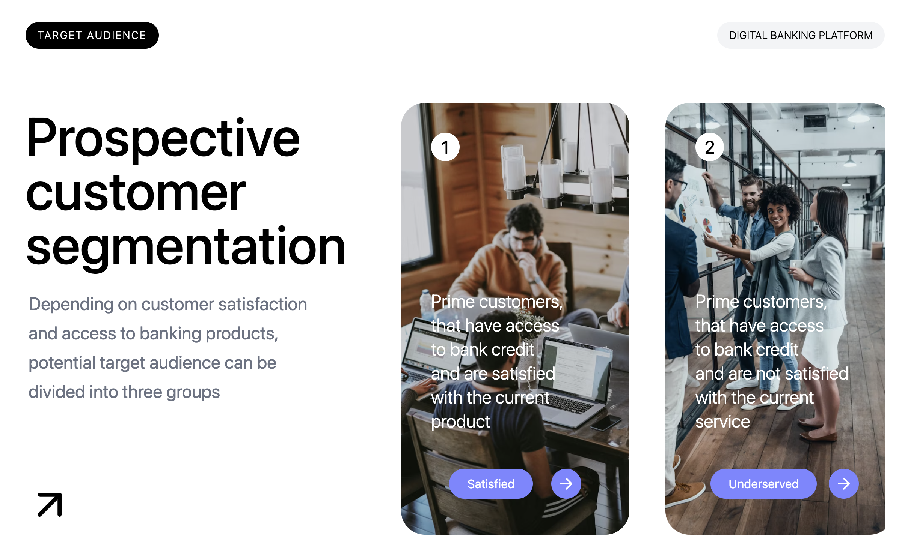

# 🚀 Customer Segmentation UI (React)

A modern and visually engaging **Customer Segmentation UI** built using React and Tailwind CSS. This project demonstrates clean UI design, reusable components, and dynamic rendering of customer segments using structured data.

---

## ✨ Features

* Dynamic card rendering using **map()**
* Data-driven UI using structured **JavaScript objects**
* Reusable **SegmentCard component**
* Clean and modern UI with **Tailwind CSS**
* Horizontal scroll layout with hidden scrollbar
* Component-based architecture

---

## 🧠 Concepts Used

* React Components
* Props (data passing)
* Array methods (`map`)
* JSX (HTML in React)
* Tailwind CSS (utility-first styling)
* Flexbox layout

---

## 📁 Project Structure

```bash
src/
 ├── components/
 │    ├── CustomerSegmentation.jsx   # Main layout wrapper
 │    ├── Header.jsx                # Top section UI
 │    ├── MainSection.jsx           # Layout split (left + right)
 │    ├── TextSection.jsx           # Left content (heading + text)
 │    ├── VisualSection.jsx         # Right scrollable cards
 │    ├── SegmentCard.jsx           # Individual card component
 │
 ├── data/
 │    ├── segmentCardData.js        # Card data (array of objects)
 │
 ├── App.jsx
 ├── index.css
 ├── main.jsx
```

---

## 📸 Preview



---

## 🛠️ Tech Stack

* React (Vite)
* JavaScript (ES6)
* Tailwind CSS
* HTML (JSX)

---

## ⚙️ How It Works

* Customer segment data is stored in a structured array (`SegmentCardData`)
* Cards are rendered dynamically using `map()`
* Each card receives its data via props
* Layout is divided into:

  * **TextSection** → heading and description
  * **VisualSection** → horizontally scrollable cards
* Tailwind CSS is used for styling and layout

---

## 🚀 Installation & Setup

```bash
git clone https://github.com/hrjoshi1302/customer-segmentation-ui.git
cd customer-segmentation-ui
npm install
npm run dev
```

---

## 👨‍💻 Author

**Himal Joshi**
